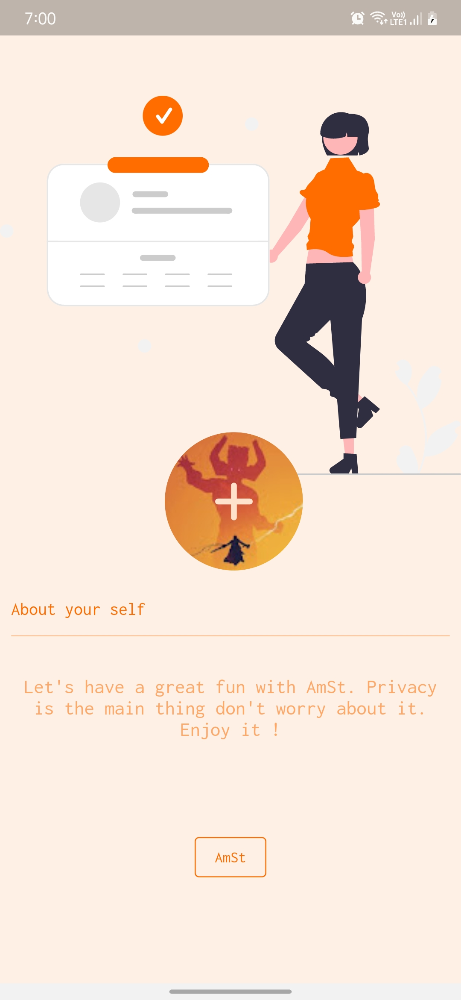

# AmSt 

*A messaging application which uses Firebase for backend and Getx for statemanagement having minimalstic user interface*

## Features
1. Chatting with Peer
2. Able to send image
3. Notifications
4. Last seen 

### Packages Used:
| Plugins                     | Versions |
|-----------------------------|----------|
| firebase_auth               | 3.3.19   |
| firebase_core               | 1.17.1   |
| font_awesome_flutter        | 10.1.0   |
| get                         | 4.6.5    |
| google_fonts                | 3.0.1    |
| google_sign_in              | 5.3.2    |
| cloud_firestore             | 3.1.17   |
| fluttertoast                | 8.0.9    |
| image_picker                | 0.8.5+3  |
| cached_network_image        | 3.2.1    |
| firebase_storage            | 10.2.17  |
| intl                        | 0.17.0   |
| auto_size_text              | 3.0.0    |
| flutter_svg                 | 1.1.0    |
| flutter_local_notifications | 9.5.3+1  |
| http                        | 0.13.4   |
| dart_emoji                  | 0.2.0+2  |
| flutter_native_splash       | 2.2.3    |
#### SING UP SCREEN

#### ABOUT SCREEN

#### HOME SCREEN

#### DRAWER

#### CHAT SCREEN

#### NOTIFICATION

#### OTHER FUNCTIONALITY

### LINK
[App link for download](https://github.com/Thiru-01/amst/raw/main/out/AmSt.apk)
